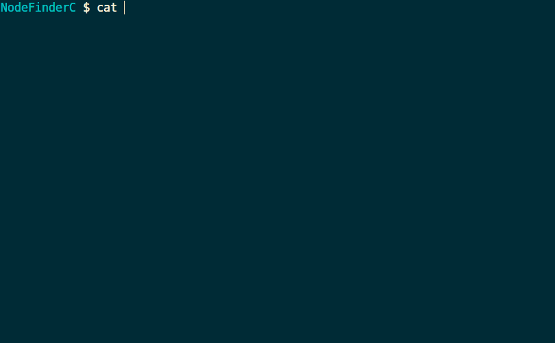

NodeFinderC
===========

Introduction
------------

NodeFinderC is C implementation of NodeFinder program (Originally implemented with Python).

Precompiled binary executables are available here: [Windows & Linux & MacOS executables](https://github.com/zxjsdp/NodeFinderC/releases/).

If you prefer programs with GUI (Graphical User Interface), please check the GUI version of NodeFinder: [NodeFinderGUI](https://github.com/zxjsdp/NodeFinderGUI).

How to compile
--------------

Make install

    make install

Or

    gcc nodefinderc.c -o bin/nodefinderc-latest

Or

    cd scripts && bash compile_to_bin.sh

After compiling, you can find NodeFinderC executable in `bin/` folder.

Usage
-----

Basic usage:

    /path/to/nodefinder -i input_tree.nwk -c config_file.txt -o output_tree.nwk

You can read help message with `-h` argument:

    /path/to/nodefinder -h

You can read version information with `-v` argument:

    /path/to/nodefinder -v

Tips:

- `-i`, `-c`, and `-o` must be specified.
- `-i` means input_tree.nwk, which is a Newick format tree file;
- `-c` means config_file.txt, please refer to [**Configuaration File Syntax**](https://github.com/zxjsdp/NodeFinderC#configuration-file-syntax) part;
- `-o` means output_tree.nwk, which will be the new generated output Newick format tree file.
- `-h` will print help message then quit, whether other arguments were specified or not.
- `-v` will print version info then quit, whether other arguments were specified or not.

Configuration File Syntax
-------------------------

Overview:

    name_a, name_b, calibration_infomation_1;
    name_c, name_d, calibration_infomation_2;
    name_a, name_b, clade_label_information;
    name, branch_label_information;
    ..., ..., ...;

Tips:

- Elemenets in each line should be seperated by commas: `,` (halfwidth);
- Each config line must end with a semicolon: `;` (halfwidth);
- Spaces, newlines, and tabs are acceptable in config file, the program will ignore them;
- You can comment a line (make it ignored) by adding `#` at the beginning of the line;

Implementation
--------------

Given two species, this program finds all ancestor nodes for each species by
using stack (to exclude other monophyletic group) and parenthesis. Then compare
these two ancestor node list and find the index of most recent common
ancestor nodes.

For example:

    List of ancestor nodes index:
    species1:     [57, 62, 73, 102, 162, 214, 258]
                                ^    ^    ^    ^
                                |    |    |    |
    species2: [39, 48, 81, 94, 102, 162, 214, 258]

    Then 102 will be the index of most recent common ancestor node.
